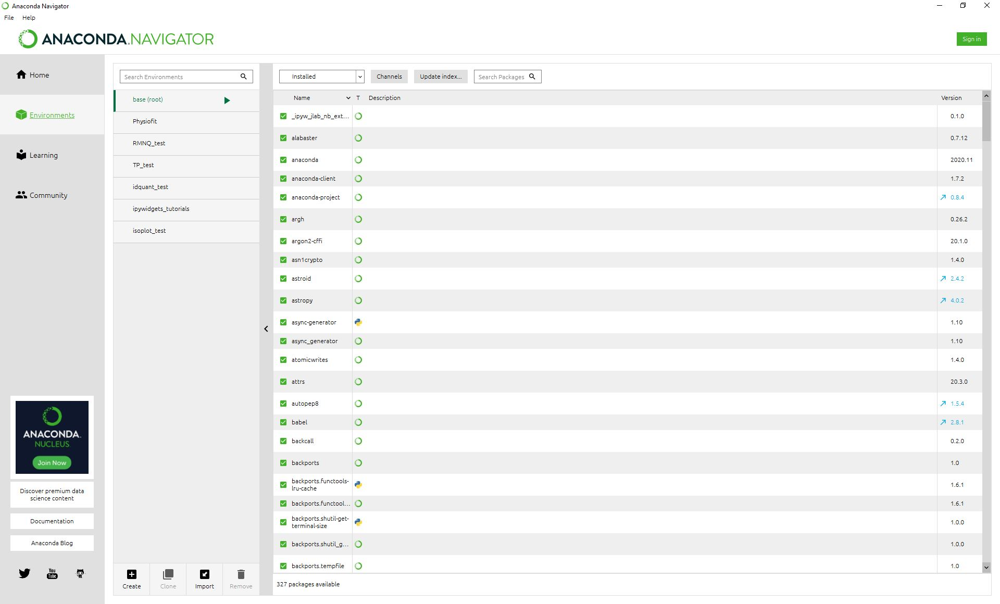
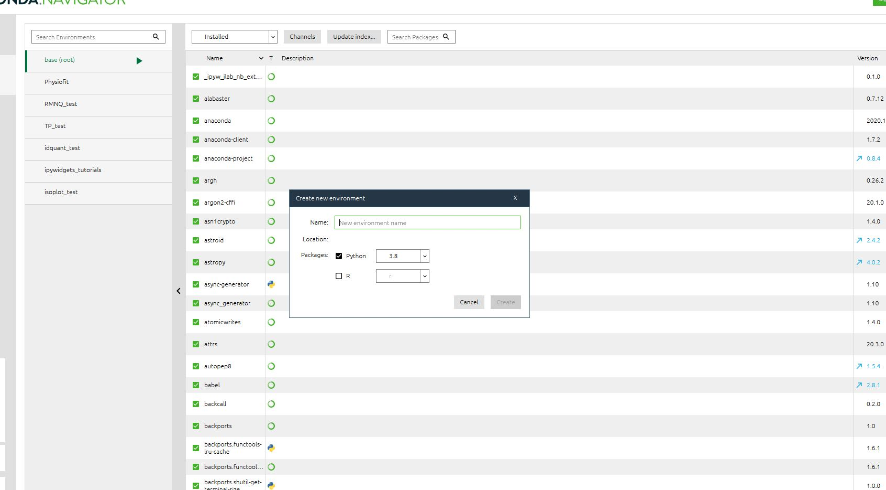
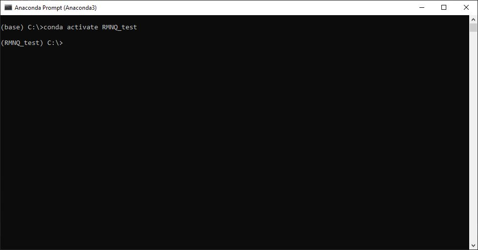
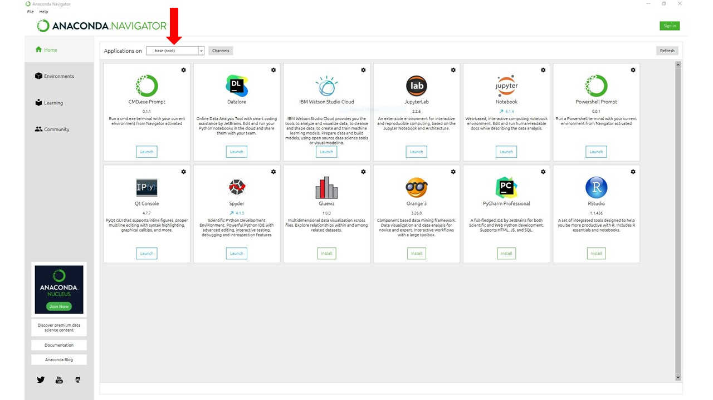

Quickstart
============

Installation
------------

NmrQuant requires Python 3.8 or higher. If you do not have a Python environment configured on your computer,
we recommend that you follow the instructions from `Anaconda <https://www.anaconda.com/products/individual>`_.
Then, open a terminal (e.g. run Anaconda Prompt if you have Anaconda installed) and type :

.. code-block:: bash

    pip install nmrquant

Next, jupyter notebook (JN) needs to be installed. You can find documentation on how to install JN on their
`website <https://jupyter.org/install>`_. It is also possible to install JN through Anaconda (see Environments for
best practices).
Finally, the notebook file containing the gui interface can be found on the
`GitHub page <https://github.com/llegregam/NmrQuant>`_.

Environment installation
------------------------

One of the advantages of the Anaconda Suite is that it gives access to a user-friendly GUI for the creation and
maintenance of python environments. Python environments give the user a way to separate different installations of
tools so that different package dependencies do not overlap  with each other. This is especially useful if packages
share the same dependencies but in different versions. The Anaconda Suite provides a quick and intuitive way of
separating these installations.

How to create an environment in Anaconda
^^^^^^^^^^^^^^^^^^^^^^^^^^^^^^^^^^^^^^^^

When the user opens up the Anaconda software, she/he ends up on the main menu:

.. image:: _static/Environment_installation/1.jpg
    :width: 100%
    :align: center

The main window shows all the tools available for installation in the Navigator. To get to the environments page, the
user must click on the "Environments" panel that is in the left-side menu.

Once on the Environments page, the user can click on the "create" button that is present at the bottom left of the
screen. A pop up menu will then appear and allow the user to select a python version and a name for the environment.

Once the user clicks on the "create" button the environment is created and ready for use!

Installing packages in the environment
^^^^^^^^^^^^^^^^^^^^^^^^^^^^^^^^^^^^^^

Now that the environment exists, it is time to populate it with the tools needed. The first thing to do is to open
up a command-line interface, preferably Anaconda Prompt (it is the one that will be used in this tutorial. Other
command-line interfaces might use different names for commands). Once the interface is open, the first thing to do
is to activate the desired environment. The command for this is as follows:

.. code-block:: bash

    conda activate <name-of-environment>

Once this is done the environment name should be seen on the left of the screen behind the name of the directory
the interface is open in.

Once the environment is activated, the user can install using pip or conda any of the desired tools. The dependencies
and the tool itself will now be installed in a safe and separate set of folders which will ensure that other
installations are not affected by anything happening in the environment. Once the user is done, she/he can now
close the prompt.

Installing and launching Jupyter Notebooks through the Navigator
^^^^^^^^^^^^^^^^^^^^^^^^^^^^^^^^^^^^^^^^^^^^^^^^^^^^^^^^^^^^^^^^

There are two ways of installing Jupyter Notebook (JN): through the command-line or through the Anaconda Navigator. We will
here explain the way to do it the second way.

First, the user must open the Anaconda Navigator. Once on the main page, the first thing to do is to select the desired
environment of installation of JN by clicking on the dropdown menu shown below and selecting the environment.

Once the environment is selected, the user can search for JN in the main page and click the install button underneath.
Once JN is installed, the last step is to launch the application.